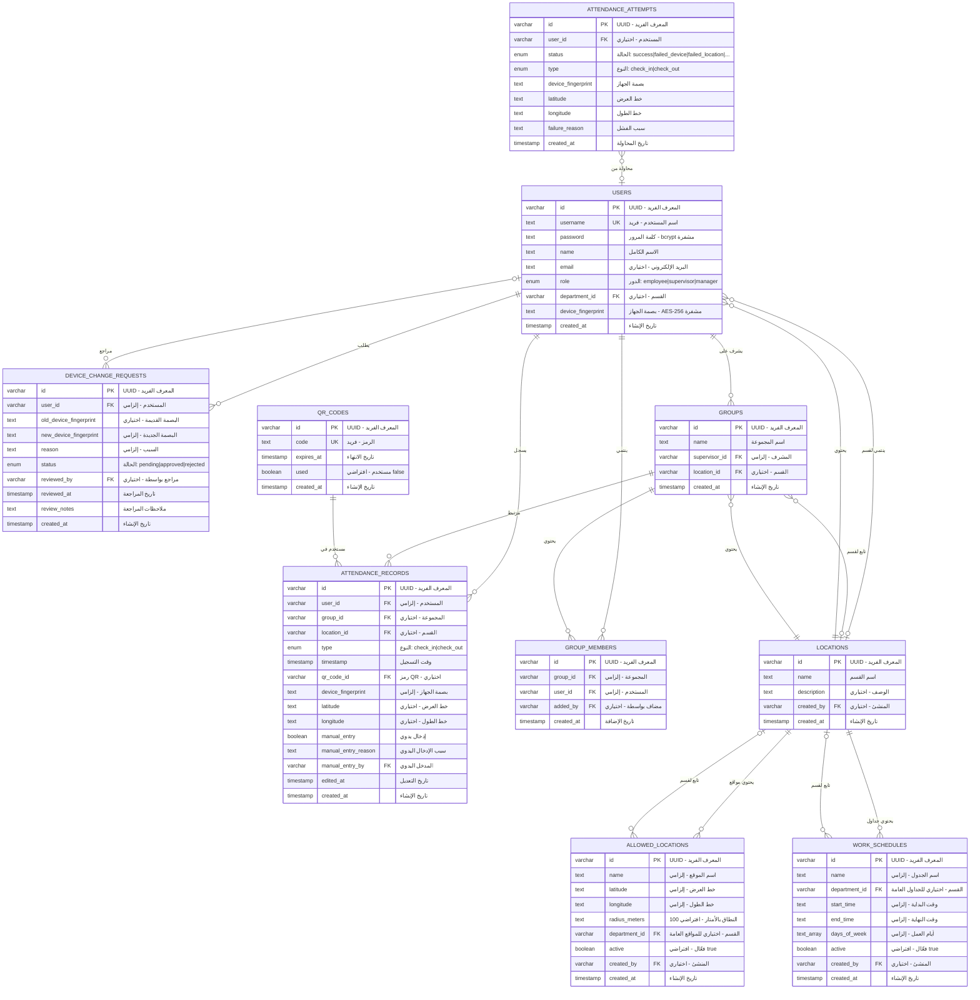
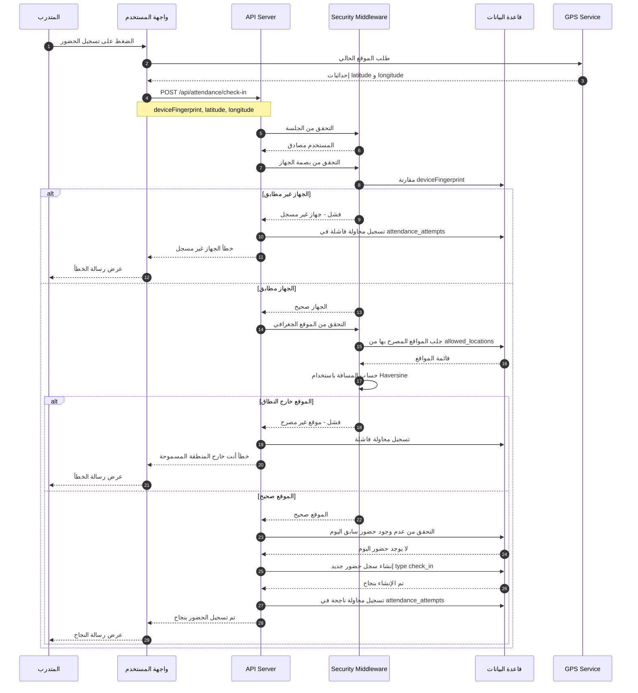
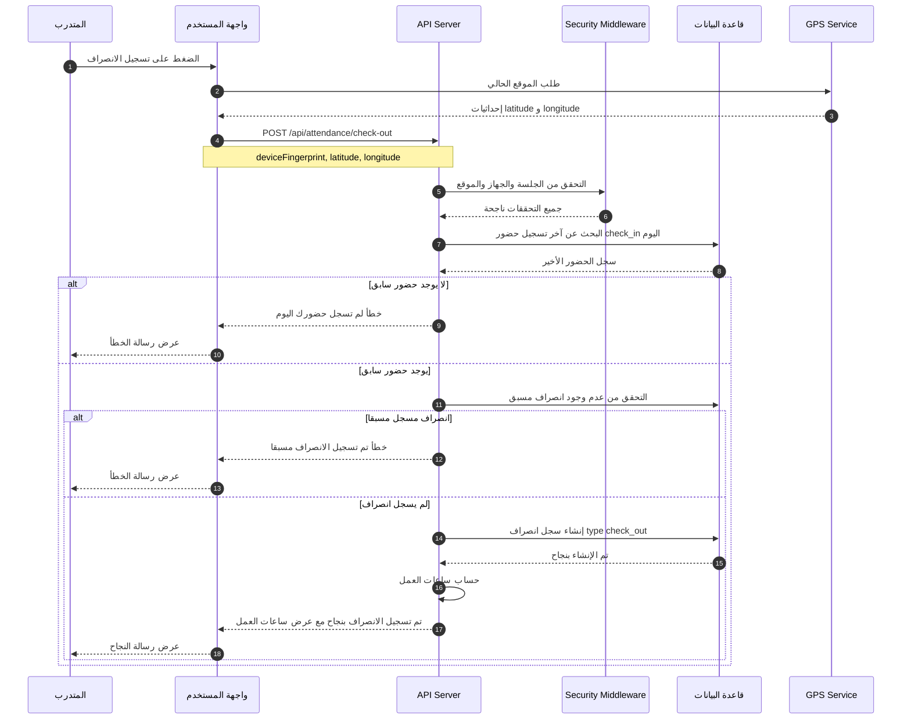
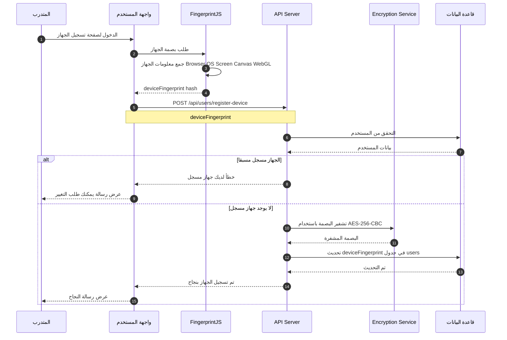
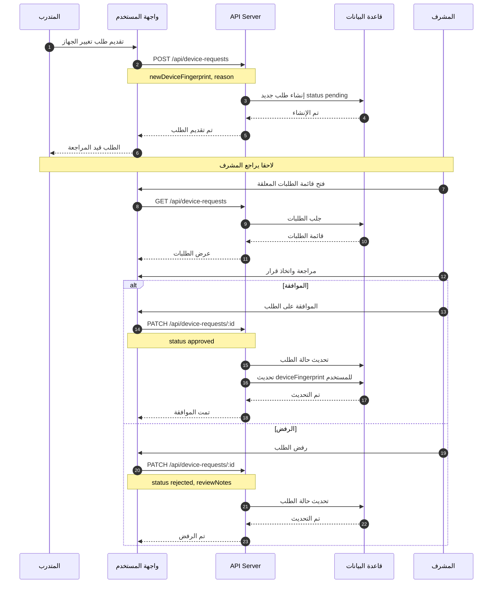
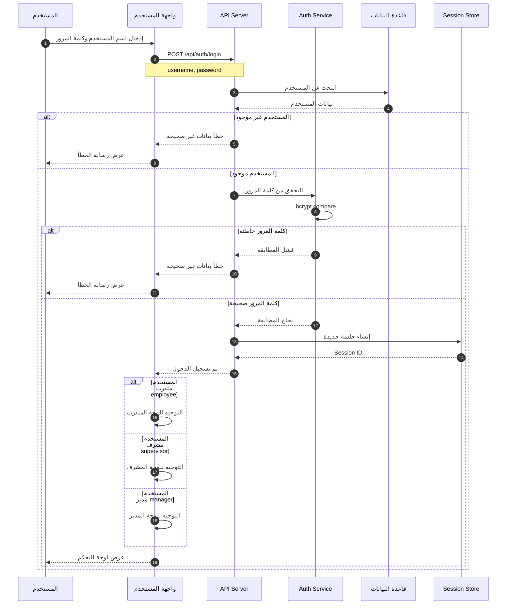
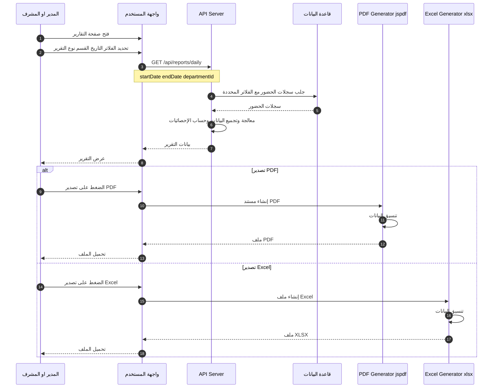

# System Diagrams - الرسوم البيانية للنظام
# نظام سارة لإدارة الحضور والموارد البشرية

**الإصدار:** 1.0  
**التاريخ:** ديسمبر 2024  
**المؤسسة:** مستشفى الملك خالد - حائل

---

## جدول المحتويات

1. [Use Case Diagram - مخطط حالات الاستخدام](#1-use-case-diagram---مخطط-حالات-الاستخدام)
2. [ER Diagram - مخطط الكيانات والعلاقات](#2-er-diagram---مخطط-الكيانات-والعلاقات)
3. [Sequence Diagrams - مخططات التسلسل](#3-sequence-diagrams---مخططات-التسلسل)
4. [Class Diagram - مخطط الفئات](#4-class-diagram---مخطط-الفئات)

---

## 1. Use Case Diagram - مخطط حالات الاستخدام

### 1.1 الوصف
يوضح هذا المخطط التفاعلات بين المستخدمين (الممثلين) والنظام، مع تحديد الوظائف المتاحة لكل دور.

### 1.2 الممثلون (Actors)

| الممثل | الوصف (عربي) | Description |
|--------|--------------|-------------|
| متدرب (Trainee) | المستخدم الأساسي الذي يسجل حضوره | Primary user who records attendance |
| مشرف (Supervisor) | مسؤول عن إدارة قسم معين ويرث صلاحيات المتدرب | Responsible for managing a department, inherits Trainee permissions |
| مدير (Manager) | الإدارة العليا مع صلاحيات كاملة ويرث صلاحيات المشرف | Top management with full access, inherits Supervisor permissions |

### 1.3 مخطط حالات الاستخدام (PlantUML Text Notation)

```
@startuml Sara Portal Use Case Diagram

left to right direction
skinparam packageStyle rectangle

actor "متدرب\n(Trainee)" as Trainee
actor "مشرف\n(Supervisor)" as Supervisor
actor "مدير\n(Manager)" as Manager

Supervisor --|> Trainee : extends
Manager --|> Supervisor : extends

rectangle "نظام سارة للحضور\nSara Attendance System" {
    
    ' === حالات استخدام المتدرب ===
    usecase "UC-01: تسجيل الدخول\nLogin" as UC01
    usecase "UC-02: تسجيل الخروج\nLogout" as UC02
    usecase "UC-03: تسجيل الحضور\nCheck-In" as UC03
    usecase "UC-04: تسجيل الانصراف\nCheck-Out" as UC04
    usecase "UC-05: عرض السجل الشخصي\nView Personal Records" as UC05
    usecase "UC-06: تسجيل الجهاز\nRegister Device" as UC06
    usecase "UC-07: طلب تغيير الجهاز\nRequest Device Change" as UC07
    usecase "UC-08: عرض الإحصائيات\nView Statistics" as UC08
    
    ' === حالات استخدام المشرف ===
    usecase "UC-10: إدارة مواقع القسم\nManage Department Locations" as UC10
    usecase "UC-11: إدارة جداول القسم\nManage Department Schedules" as UC11
    usecase "UC-12: الموافقة على طلبات الأجهزة\nApprove Device Requests" as UC12
    usecase "UC-13: عرض تقارير القسم\nView Department Reports" as UC13
    usecase "UC-14: إدارة متدربي القسم\nManage Department Trainees" as UC14
    
    ' === حالات استخدام المدير ===
    usecase "UC-20: إدارة الأقسام\nManage Departments" as UC20
    usecase "UC-21: إدارة المستخدمين\nManage Users" as UC21
    usecase "UC-22: إدارة المواقع العامة\nManage Global Locations" as UC22
    usecase "UC-23: إعدادات النظام\nSystem Settings" as UC23
    usecase "UC-24: عرض التقارير الشاملة\nView All Reports" as UC24
    usecase "UC-25: تصدير التقارير\nExport Reports" as UC25
    
    ' === حالات استخدام مضمنة (Include) ===
    usecase "التحقق من GPS\nVerify GPS Location" as VerifyGPS
    usecase "التحقق من بصمة الجهاز\nVerify Device Fingerprint" as VerifyDevice
    usecase "تشفير البيانات\nEncrypt Data" as EncryptData
    
    ' === علاقات المتدرب ===
    Trainee --> UC01
    Trainee --> UC02
    Trainee --> UC03
    Trainee --> UC04
    Trainee --> UC05
    Trainee --> UC06
    Trainee --> UC07
    Trainee --> UC08
    
    ' === علاقات المشرف (إضافية) ===
    Supervisor --> UC10
    Supervisor --> UC11
    Supervisor --> UC12
    Supervisor --> UC13
    Supervisor --> UC14
    
    ' === علاقات المدير (إضافية) ===
    Manager --> UC20
    Manager --> UC21
    Manager --> UC22
    Manager --> UC23
    Manager --> UC24
    Manager --> UC25
    
    ' === علاقات Include ===
    UC03 ..> VerifyGPS : <<include>>
    UC03 ..> VerifyDevice : <<include>>
    UC04 ..> VerifyGPS : <<include>>
    UC04 ..> VerifyDevice : <<include>>
    UC06 ..> EncryptData : <<include>>
    VerifyDevice ..> EncryptData : <<include>>
    
    ' === علاقات Extend ===
    UC25 ..> UC13 : <<extend>>
    UC25 ..> UC24 : <<extend>>
}

@enduml
```

### 1.4 تمثيل نصي للعلاقات (Text-Based Diagram)

```
+-----------------------------------------------------------------------------------+
|                         نظام سارة للحضور (Sara Attendance System)                  |
+-----------------------------------------------------------------------------------+
|                                                                                   |
|    ┌─────────────────────────────────────────────────────────────────────────┐   |
|    │                    حالات استخدام المتدرب (Trainee)                       │   |
|    ├─────────────────────────────────────────────────────────────────────────┤   |
|    │  ○ UC-01: تسجيل الدخول                                                  │   |
|    │  ○ UC-02: تسجيل الخروج                                                  │   |
|    │  ○ UC-03: تسجيل الحضور ──────<<include>>──── التحقق من GPS             │   |
|    │                        └───<<include>>──── التحقق من بصمة الجهاز        │   |
|    │  ○ UC-04: تسجيل الانصراف ────<<include>>──── التحقق من GPS             │   |
|    │                          └───<<include>>──── التحقق من بصمة الجهاز      │   |
|    │  ○ UC-05: عرض السجل الشخصي                                              │   |
|    │  ○ UC-06: تسجيل الجهاز ──────<<include>>──── تشفير البيانات             │   |
|    │  ○ UC-07: طلب تغيير الجهاز                                              │   |
|    │  ○ UC-08: عرض الإحصائيات الشخصية                                        │   |
|    └─────────────────────────────────────────────────────────────────────────┘   |
|           ▲                                                                       |
|           │ <<extends>>                                                           |
|           │                                                                       |
|    ┌─────────────────────────────────────────────────────────────────────────┐   |
|    │                حالات استخدام المشرف (Supervisor) - إضافية               │   |
|    ├─────────────────────────────────────────────────────────────────────────┤   |
|    │  ○ UC-10: إدارة مواقع القسم                                             │   |
|    │  ○ UC-11: إدارة جداول عمل القسم                                         │   |
|    │  ○ UC-12: الموافقة على طلبات الأجهزة                                    │   |
|    │  ○ UC-13: عرض تقارير القسم ─────<<extend>>───── تصدير PDF/Excel        │   |
|    │  ○ UC-14: إدارة متدربي القسم                                            │   |
|    └─────────────────────────────────────────────────────────────────────────┘   |
|           ▲                                                                       |
|           │ <<extends>>                                                           |
|           │                                                                       |
|    ┌─────────────────────────────────────────────────────────────────────────┐   |
|    │                  حالات استخدام المدير (Manager) - إضافية                │   |
|    ├─────────────────────────────────────────────────────────────────────────┤   |
|    │  ○ UC-20: إدارة جميع الأقسام                                            │   |
|    │  ○ UC-21: إدارة المستخدمين والصلاحيات                                   │   |
|    │  ○ UC-22: إدارة المواقع العامة                                          │   |
|    │  ○ UC-23: إعدادات النظام                                                │   |
|    │  ○ UC-24: عرض التقارير الشاملة ─────<<extend>>───── تصدير PDF/Excel    │   |
|    │  ○ UC-25: تصدير التقارير (PDF/Excel)                                    │   |
|    └─────────────────────────────────────────────────────────────────────────┘   |
|                                                                                   |
+-----------------------------------------------------------------------------------+

الممثلون (Actors):
  [متدرب] ────────────────┐
      ▲                    │
      │ extends            │ يستخدم جميع حالات المتدرب
  [مشرف] ─────────────────┤
      ▲                    │ يستخدم جميع حالات المشرف + المتدرب
      │ extends            │
  [مدير] ─────────────────┘ يستخدم جميع حالات النظام
```

### 1.5 جدول حالات الاستخدام التفصيلي

#### حالات الاستخدام للمتدرب (Trainee Use Cases)

| معرف | حالة الاستخدام | الوصف | المتطلبات المسبقة | Include/Extend |
|------|----------------|-------|-------------------|----------------|
| UC-01 | تسجيل الدخول | إدخال اسم المستخدم وكلمة المرور | حساب مفعّل | - |
| UC-02 | تسجيل الخروج | إنهاء الجلسة الحالية | مُسجّل الدخول | - |
| UC-03 | تسجيل الحضور | تسجيل بداية الدوام | جهاز مسجل + موقع مصرح | <<include>> GPS, Device |
| UC-04 | تسجيل الانصراف | تسجيل نهاية الدوام | تسجيل حضور سابق | <<include>> GPS, Device |
| UC-05 | عرض السجل الشخصي | مراجعة سجلات الحضور | مُسجّل الدخول | - |
| UC-06 | تسجيل الجهاز | ربط الجهاز بالحساب | جهاز غير مسجل | <<include>> Encrypt |
| UC-07 | طلب تغيير الجهاز | طلب استبدال الجهاز | جهاز مسجل سابقاً | - |
| UC-08 | عرض الإحصائيات | مراجعة إحصائيات الحضور | مُسجّل الدخول | - |

#### حالات الاستخدام للمشرف (Supervisor Use Cases)

| معرف | حالة الاستخدام | الوصف | النطاق |
|------|----------------|-------|--------|
| UC-10 | إدارة مواقع القسم | إضافة/تعديل/حذف المواقع المصرح بها | القسم فقط |
| UC-11 | إدارة جداول القسم | إضافة/تعديل جداول العمل | القسم فقط |
| UC-12 | الموافقة على الطلبات | مراجعة طلبات تغيير الأجهزة | متدربي القسم |
| UC-13 | عرض تقارير القسم | تقارير حضور القسم | القسم فقط |
| UC-14 | إدارة المتدربين | عرض وإدارة متدربي القسم | القسم فقط |

#### حالات الاستخدام للمدير (Manager Use Cases)

| معرف | حالة الاستخدام | الوصف | النطاق |
|------|----------------|-------|--------|
| UC-20 | إدارة الأقسام | إضافة/تعديل/حذف الأقسام | النظام كاملاً |
| UC-21 | إدارة المستخدمين | إضافة/تعديل المستخدمين والصلاحيات | جميع المستخدمين |
| UC-22 | إدارة المواقع العامة | مواقع تسجيل لجميع الأقسام | جميع الأقسام |
| UC-23 | إعدادات النظام | تكوين إعدادات النظام | النظام كاملاً |
| UC-24 | التقارير الشاملة | تقارير على مستوى المؤسسة | جميع الأقسام |
| UC-25 | تصدير التقارير | تصدير PDF و Excel | جميع التقارير |

---

## 2. ER Diagram - مخطط الكيانات والعلاقات

### 2.1 الوصف
يوضح هذا المخطط هيكل قاعدة البيانات والعلاقات بين الجداول مع الـ Cardinality الصحيحة.

### 2.2 ملاحظات حول العلاقات (Cardinality)
- `||--||` : One to One (إلزامي)
- `||--o|` : One to Zero or One (اختياري)
- `||--|{` : One to Many (إلزامي على الأقل واحد)
- `||--o{` : One to Zero or Many (اختياري - صفر أو أكثر)
- `}|--|{` : Many to Many

### 2.3 مخطط ER (Mermaid)



### 2.4 وصف الجداول

| الجدول | الوصف (عربي) | Description | عدد الحقول |
|--------|--------------|-------------|------------|
| users | المستخدمين | System users (trainees, supervisors, managers) | 9 |
| locations | الأقسام | Departments/Locations | 5 |
| groups | المجموعات | Work groups under supervisors | 5 |
| group_members | أعضاء المجموعات | Many-to-many user-group membership | 5 |
| attendance_records | سجلات الحضور | Check-in/check-out records | 14 |
| device_change_requests | طلبات تغيير الأجهزة | Device change approval workflow | 10 |
| allowed_locations | المواقع المصرح بها | GPS locations where attendance is allowed | 9 |
| work_schedules | جداول العمل | Working hours and days configuration | 9 |
| attendance_attempts | محاولات التسجيل | Audit log of all attendance attempts | 9 |
| qr_codes | رموز QR | Time-limited QR codes for verification | 5 |

### 2.5 جدول العلاقات مع Cardinality

| العلاقة | النوع | الإلزامية | الوصف |
|---------|-------|-----------|-------|
| users.departmentId → locations.id | Many-to-One | اختياري | مستخدم يمكن أن ينتمي لقسم واحد أو لا ينتمي لأي قسم |
| users → attendance_records | One-to-Many | - | كل مستخدم له صفر أو أكثر من سجلات الحضور |
| users → device_change_requests | One-to-Many | - | كل مستخدم يمكنه تقديم صفر أو أكثر من طلبات تغيير الجهاز |
| groups.supervisorId → users.id | Many-to-One | إلزامي | كل مجموعة يجب أن يكون لها مشرف واحد |
| groups.locationId → locations.id | Many-to-One | اختياري | المجموعة يمكن أن تنتمي لقسم أو تكون عامة |
| allowed_locations.departmentId → locations.id | Many-to-One | اختياري | الموقع يمكن أن يكون خاص بقسم أو عام |
| work_schedules.departmentId → locations.id | Many-to-One | اختياري | الجدول يمكن أن يكون خاص بقسم أو عام |
| device_change_requests.reviewedBy → users.id | Many-to-One | اختياري | الطلب قد يكون مراجع أو لا (pending) |

---

## 3. Sequence Diagrams - مخططات التسلسل

### 3.1 تسجيل الحضور (Check-In Process)



### 3.2 تسجيل الانصراف (Check-Out Process)



### 3.3 تسجيل الجهاز (Device Registration)



### 3.4 طلب تغيير الجهاز (Device Change Request)



### 3.5 تسجيل الدخول (Login Process)



### 3.6 إنشاء تقرير (Report Generation)



---

## 4. Class Diagram - مخطط الفئات

### 4.1 الوصف
يوضح هذا المخطط البنية الهيكلية للكود من ناحية الفئات والخصائص والعلاقات.

### 4.2 مخطط الفئات (Mermaid)

```mermaid
classDiagram
    direction TB
    
    class User {
        +String id
        +String username
        +String password
        +String name
        +String email
        +Role role
        +String departmentId
        +String deviceFingerprint
        +Date createdAt
        +login() Boolean
        +logout() void
        +checkIn(latitude, longitude) AttendanceRecord
        +checkOut(latitude, longitude) AttendanceRecord
        +registerDevice(fingerprint) Boolean
        +requestDeviceChange(newFingerprint, reason) DeviceChangeRequest
    }
    
    class Location {
        +String id
        +String name
        +String description
        +String createdBy
        +Date createdAt
        +getEmployees() User[]
        +getGroups() Group[]
        +getAllowedLocations() AllowedLocation[]
        +getWorkSchedules() WorkSchedule[]
    }
    
    class Group {
        +String id
        +String name
        +String supervisorId
        +String locationId
        +Date createdAt
        +addMember(userId) GroupMember
        +removeMember(userId) Boolean
        +getMembers() User[]
    }
    
    class GroupMember {
        +String id
        +String groupId
        +String userId
        +String addedBy
        +Date createdAt
    }
    
    class AttendanceRecord {
        +String id
        +String userId
        +String groupId
        +String locationId
        +AttendanceType type
        +Date timestamp
        +String deviceFingerprint
        +String latitude
        +String longitude
        +Boolean manualEntry
        +String manualEntryReason
        +Date createdAt
        +calculateWorkHours() Number
    }
    
    class DeviceChangeRequest {
        +String id
        +String userId
        +String oldDeviceFingerprint
        +String newDeviceFingerprint
        +String reason
        +RequestStatus status
        +String reviewedBy
        +Date reviewedAt
        +String reviewNotes
        +Date createdAt
        +approve(reviewerId, notes) Boolean
        +reject(reviewerId, notes) Boolean
    }
    
    class AllowedLocation {
        +String id
        +String name
        +String latitude
        +String longitude
        +String radiusMeters
        +String departmentId
        +Boolean active
        +String createdBy
        +Date createdAt
        +isWithinRadius(lat, lon) Boolean
    }
    
    class WorkSchedule {
        +String id
        +String name
        +String departmentId
        +String startTime
        +String endTime
        +String[] daysOfWeek
        +Boolean active
        +String createdBy
        +Date createdAt
        +isWorkingTime(datetime) Boolean
    }
    
    class AttendanceAttempt {
        +String id
        +String userId
        +AttemptStatus status
        +AttendanceType type
        +String deviceFingerprint
        +String latitude
        +String longitude
        +String failureReason
        +Date createdAt
    }
    
    class QRCode {
        +String id
        +String code
        +Date expiresAt
        +Boolean used
        +Date createdAt
        +isValid() Boolean
        +markAsUsed() void
    }
    
    class SecurityService {
        <<service>>
        +encryptFingerprint(plaintext) String
        +decryptFingerprint(ciphertext) String
        +verifyFingerprint(input, stored) Boolean
        +hashPassword(password) String
        +verifyPassword(password, hash) Boolean
    }
    
    class GPSService {
        <<service>>
        +calculateDistance(lat1, lon1, lat2, lon2) Number
        +isWithinRadius(userLat, userLon, locLat, locLon, radius) Boolean
        +getHaversineDistance(lat1, lon1, lat2, lon2) Number
    }
    
    class AuthService {
        <<service>>
        +login(username, password) Session
        +logout(sessionId) void
        +validateSession(sessionId) User
        +createSession(userId) String
        +destroySession(sessionId) void
    }
    
    class ReportService {
        <<service>>
        +generateDailyReport(date, departmentId) Report
        +generateMonthlyReport(year, month, departmentId) Report
        +exportToPDF(data) File
        +exportToExcel(data) File
        +calculateStatistics(records) Statistics
    }
    
    class Role {
        <<enumeration>>
        EMPLOYEE
        SUPERVISOR
        MANAGER
    }
    
    class AttendanceType {
        <<enumeration>>
        CHECK_IN
        CHECK_OUT
    }
    
    class RequestStatus {
        <<enumeration>>
        PENDING
        APPROVED
        REJECTED
    }
    
    class AttemptStatus {
        <<enumeration>>
        SUCCESS
        FAILED_DEVICE
        FAILED_LOCATION
        FAILED_SCHEDULE
        FAILED_RATE_LIMIT
    }
    
    User "1" --> "0..*" AttendanceRecord : records
    User "1" --> "0..*" DeviceChangeRequest : requests
    User "1" --> "0..*" GroupMember : memberships
    User "0..*" --> "0..1" Location : department
    User "1" --> "0..*" Group : supervises
    
    Location "1" --> "0..*" User : employees
    Location "1" --> "0..*" Group : groups
    Location "1" --> "0..*" AllowedLocation : allowedLocations
    Location "1" --> "0..*" WorkSchedule : schedules
    
    Group "1" --> "0..*" GroupMember : members
    Group "0..*" --> "1" User : supervisor
    Group "0..*" --> "0..1" Location : location
    
    AllowedLocation "0..*" --> "0..1" Location : department
    WorkSchedule "0..*" --> "0..1" Location : department
    
    DeviceChangeRequest "0..*" --> "0..1" User : reviewer
    
    AttendanceRecord ..> SecurityService : uses
    AttendanceRecord ..> GPSService : uses
    
    User ..> AuthService : uses
    User ..> SecurityService : uses
    
    AllowedLocation ..> GPSService : uses
```



### 4.3 وصف الفئات الرئيسية

#### فئات الكيانات (Entity Classes)

| الفئة | الوصف | المسؤولية الرئيسية |
|-------|-------|-------------------|
| User | المستخدم | تمثيل بيانات المستخدم وعملياته (حضور، جهاز، صلاحيات) |
| Location | القسم | تمثيل الأقسام التنظيمية وعلاقاتها |
| Group | المجموعة | تمثيل مجموعات العمل تحت إشراف مشرف |
| AttendanceRecord | سجل الحضور | تخزين بيانات تسجيل الحضور والانصراف |
| DeviceChangeRequest | طلب تغيير الجهاز | إدارة سير عمل طلبات تغيير الأجهزة |
| AllowedLocation | الموقع المصرح | تحديد المواقع الجغرافية المسموحة للتسجيل |
| WorkSchedule | جدول العمل | تحديد أوقات وأيام العمل |
| AttendanceAttempt | محاولة التسجيل | سجل تدقيق لجميع محاولات الحضور |
| QRCode | رمز QR | إدارة رموز التحقق المؤقتة |

#### فئات الخدمات (Service Classes)

| الفئة | الوصف | التقنيات المستخدمة |
|-------|-------|-------------------|
| SecurityService | خدمة الأمان | AES-256-CBC, bcrypt |
| GPSService | خدمة GPS | Haversine formula |
| AuthService | خدمة المصادقة | express-session, passport |
| ReportService | خدمة التقارير | jspdf, xlsx |

### 4.4 التعدادات (Enumerations)

| التعداد | القيم | الاستخدام |
|---------|-------|-----------|
| Role | employee, supervisor, manager | تحديد مستوى صلاحيات المستخدم |
| AttendanceType | check_in, check_out | نوع سجل الحضور |
| RequestStatus | pending, approved, rejected | حالة طلب تغيير الجهاز |
| AttemptStatus | success, failed_device, failed_location, failed_schedule, failed_rate_limit | نتيجة محاولة التسجيل |

---

## 5. خوارزميات رئيسية

### 5.1 خوارزمية Haversine لحساب المسافة

تُستخدم لحساب المسافة بين نقطتين على سطح الأرض بناءً على إحداثيات GPS.

```
المدخلات: (lat1, lon1), (lat2, lon2) بالدرجات
المخرجات: المسافة بالأمتار

الخوارزمية:
1. R = 6371000 (نصف قطر الأرض بالأمتار)
2. φ1 = lat1 × π/180 (تحويل لراديان)
3. φ2 = lat2 × π/180
4. Δφ = (lat2 - lat1) × π/180
5. Δλ = (lon2 - lon1) × π/180
6. a = sin²(Δφ/2) + cos(φ1) × cos(φ2) × sin²(Δλ/2)
7. c = 2 × atan2(√a, √(1-a))
8. distance = R × c
```

### 5.2 تشفير AES-256-CBC

يُستخدم لتشفير بصمة الجهاز قبل تخزينها في قاعدة البيانات.

```
المدخلات: النص الأصلي (deviceFingerprint), مفتاح التشفير (DEVICE_ENCRYPTION_KEY)
المخرجات: النص المشفر (Base64)

الخوارزمية:
1. إنشاء IV عشوائي (16 bytes) باستخدام crypto.randomBytes
2. إنشاء cipher باستخدام AES-256-CBC والمفتاح والـ IV
3. تشفير النص: encrypted = cipher.update(plaintext) + cipher.final()
4. دمج IV مع النص المشفر: result = IV + encrypted
5. تحويل إلى Base64: output = result.toString('base64')
```

### 5.3 تشفير كلمة المرور (bcrypt)

```
التشفير:
1. توليد salt بـ 10 rounds
2. hash = bcrypt.hash(password, salt)

التحقق:
1. isMatch = bcrypt.compare(inputPassword, storedHash)
```

---

**نهاية الوثيقة**

*إعداد: فريق تطوير نظام سارة*  
*التاريخ: ديسمبر 2024*
