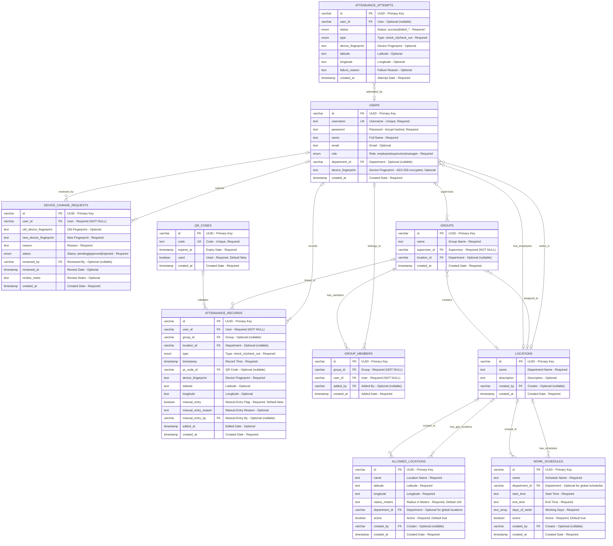
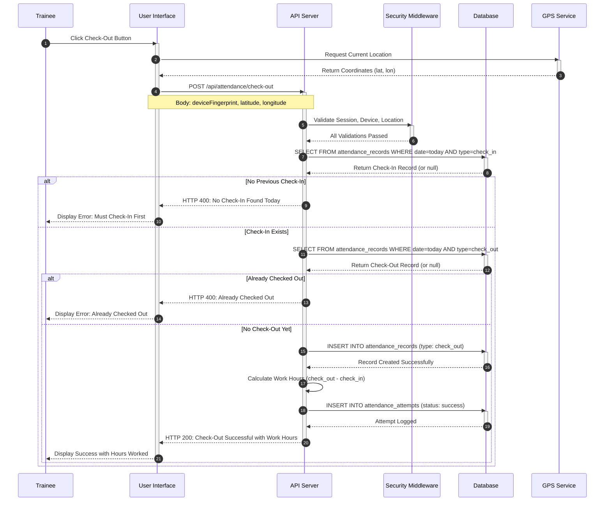
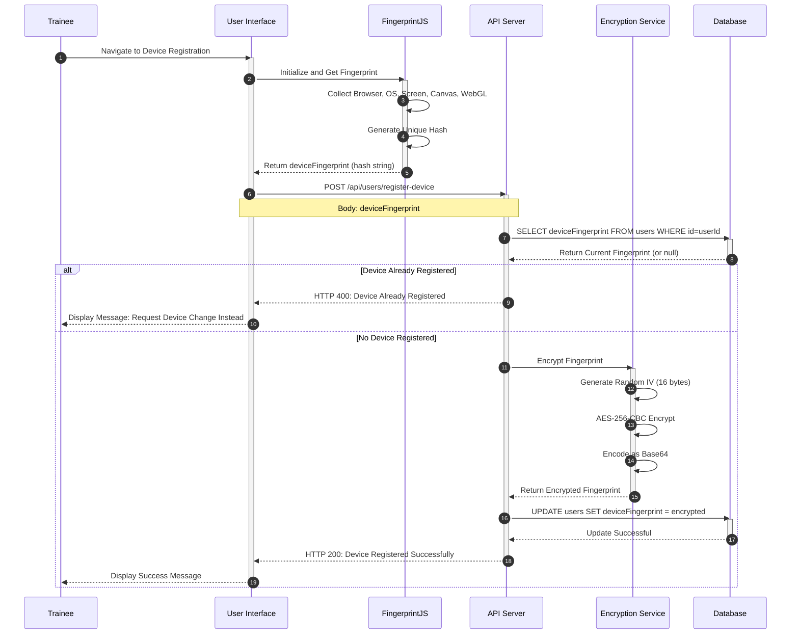
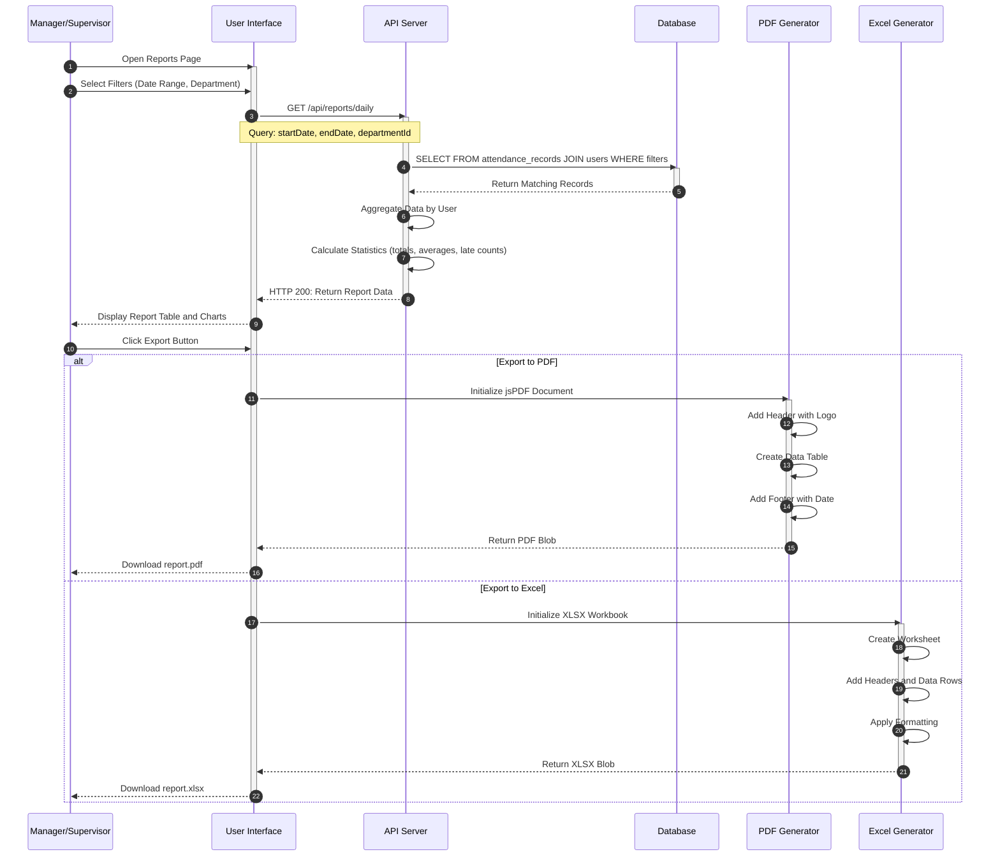

# System Diagrams - Sara Portal
# Attendance and HRM Management System

**Version:** 1.0  
**Date:** December 2024  
**Organization:** King Khalid Hospital - Hail

---

## Table of Contents

1. [Use Case Diagram](#1-use-case-diagram)
2. [Entity Relationship Diagram](#2-entity-relationship-diagram)
3. [Sequence Diagrams](#3-sequence-diagrams)
4. [Class Diagram](#4-class-diagram)

---

## 1. Use Case Diagram

### 1.1 Description
This diagram illustrates the interactions between users (actors) and the system, defining the available functions for each role.

### 1.2 Actors

| Actor | Description | Role Level |
|-------|-------------|------------|
| Trainee | Primary user who records attendance | Base level |
| Supervisor | Department manager, inherits Trainee permissions | Mid level |
| Manager | Top management with full access, inherits Supervisor permissions | Top level |

### 1.3 Use Case Diagram (PlantUML Notation)

```
@startuml Sara Portal Use Case Diagram

left to right direction
skinparam packageStyle rectangle

actor "Trainee" as Trainee
actor "Supervisor" as Supervisor
actor "Manager" as Manager

' Actor Generalization (inheritance without stereotype)
Supervisor --|> Trainee
Manager --|> Supervisor

rectangle "Sara Attendance System" {
    
    ' === Trainee Use Cases ===
    usecase "UC-01: Login" as UC01
    usecase "UC-02: Logout" as UC02
    usecase "UC-03: Check-In" as UC03
    usecase "UC-04: Check-Out" as UC04
    usecase "UC-05: View Personal Records" as UC05
    usecase "UC-06: Register Device" as UC06
    usecase "UC-07: Request Device Change" as UC07
    usecase "UC-08: View Statistics" as UC08
    
    ' === Supervisor Use Cases ===
    usecase "UC-10: Manage Department Locations" as UC10
    usecase "UC-11: Manage Department Schedules" as UC11
    usecase "UC-12: Approve Device Requests" as UC12
    usecase "UC-13: View Department Reports" as UC13
    usecase "UC-14: Manage Department Trainees" as UC14
    
    ' === Manager Use Cases ===
    usecase "UC-20: Manage Departments" as UC20
    usecase "UC-21: Manage Users" as UC21
    usecase "UC-22: Manage Global Locations" as UC22
    usecase "UC-23: System Settings" as UC23
    usecase "UC-24: View All Reports" as UC24
    
    ' === Included Use Cases (Security) ===
    usecase "Verify GPS Location" as VerifyGPS
    usecase "Verify Device Fingerprint" as VerifyDevice
    usecase "Encrypt Data" as EncryptData
    usecase "Export to PDF/Excel" as ExportReport
    
    ' === Trainee Associations ===
    Trainee --> UC01
    Trainee --> UC02
    Trainee --> UC03
    Trainee --> UC04
    Trainee --> UC05
    Trainee --> UC06
    Trainee --> UC07
    Trainee --> UC08
    
    ' === Supervisor Associations (Additional) ===
    Supervisor --> UC10
    Supervisor --> UC11
    Supervisor --> UC12
    Supervisor --> UC13
    Supervisor --> UC14
    
    ' === Manager Associations (Additional) ===
    Manager --> UC20
    Manager --> UC21
    Manager --> UC22
    Manager --> UC23
    Manager --> UC24
    
    ' === Include Relationships (mandatory behavior) ===
    UC03 ..> VerifyGPS : <<include>>
    UC03 ..> VerifyDevice : <<include>>
    UC04 ..> VerifyGPS : <<include>>
    UC04 ..> VerifyDevice : <<include>>
    UC06 ..> EncryptData : <<include>>
    VerifyDevice ..> EncryptData : <<include>>
    UC13 ..> ExportReport : <<include>>
    UC24 ..> ExportReport : <<include>>
}

@enduml
```

### 1.4 Text-Based Use Case Diagram

```
+-----------------------------------------------------------------------------------+
|                          Sara Attendance System                                    |
+-----------------------------------------------------------------------------------+
|                                                                                   |
|    +-------------------------------------------------------------------------+   |
|    |                      Trainee Use Cases                                  |   |
|    +-------------------------------------------------------------------------+   |
|    |  o UC-01: Login                                                         |   |
|    |  o UC-02: Logout                                                        |   |
|    |  o UC-03: Check-In --------<<include>>-----> Verify GPS Location        |   |
|    |                    +-------<<include>>-----> Verify Device Fingerprint  |   |
|    |  o UC-04: Check-Out -------<<include>>-----> Verify GPS Location        |   |
|    |                     +------<<include>>-----> Verify Device Fingerprint  |   |
|    |  o UC-05: View Personal Records                                         |   |
|    |  o UC-06: Register Device --<<include>>-----> Encrypt Data              |   |
|    |  o UC-07: Request Device Change                                         |   |
|    |  o UC-08: View Personal Statistics                                      |   |
|    +-------------------------------------------------------------------------+   |
|           ^                                                                       |
|           | (inherits)                                                            |
|           |                                                                       |
|    +-------------------------------------------------------------------------+   |
|    |              Supervisor Use Cases (Additional)                          |   |
|    +-------------------------------------------------------------------------+   |
|    |  o UC-10: Manage Department Locations                                   |   |
|    |  o UC-11: Manage Department Work Schedules                              |   |
|    |  o UC-12: Approve Device Change Requests                                |   |
|    |  o UC-13: View Department Reports ----<<include>>---> Export PDF/Excel  |   |
|    |  o UC-14: Manage Department Trainees                                    |   |
|    +-------------------------------------------------------------------------+   |
|           ^                                                                       |
|           | (inherits)                                                            |
|           |                                                                       |
|    +-------------------------------------------------------------------------+   |
|    |                Manager Use Cases (Additional)                           |   |
|    +-------------------------------------------------------------------------+   |
|    |  o UC-20: Manage All Departments                                        |   |
|    |  o UC-21: Manage Users and Permissions                                  |   |
|    |  o UC-22: Manage Global Locations                                       |   |
|    |  o UC-23: System Settings                                               |   |
|    |  o UC-24: View All Reports --------<<include>>---> Export PDF/Excel     |   |
|    +-------------------------------------------------------------------------+   |
|                                                                                   |
+-----------------------------------------------------------------------------------+

Actors Hierarchy (Generalization):
  [Trainee]
      ^
      | (inherits)
  [Supervisor]
      ^
      | (inherits)
  [Manager]

Note: Supervisor inherits all Trainee use cases
      Manager inherits all Supervisor use cases (including Trainee)
```

### 1.5 Detailed Use Case Table

#### Trainee Use Cases

| ID | Use Case | Description | Preconditions | Include |
|----|----------|-------------|---------------|---------|
| UC-01 | Login | Enter username and password | Active account | - |
| UC-02 | Logout | End current session | Logged in | - |
| UC-03 | Check-In | Record start of work | Registered device, Authorized location | Verify GPS, Verify Device |
| UC-04 | Check-Out | Record end of work | Previous check-in exists | Verify GPS, Verify Device |
| UC-05 | View Personal Records | Review attendance history | Logged in | - |
| UC-06 | Register Device | Bind device to account | No device registered | Encrypt Data |
| UC-07 | Request Device Change | Request device replacement | Device already registered | - |
| UC-08 | View Statistics | Review attendance statistics | Logged in | - |

#### Supervisor Use Cases

| ID | Use Case | Description | Scope | Include |
|----|----------|-------------|-------|---------|
| UC-10 | Manage Department Locations | Add/Edit/Delete authorized locations | Department only | - |
| UC-11 | Manage Department Schedules | Add/Edit work schedules | Department only | - |
| UC-12 | Approve Device Requests | Review device change requests | Department trainees | - |
| UC-13 | View Department Reports | Department attendance reports | Department only | Export PDF/Excel |
| UC-14 | Manage Department Trainees | View and manage department trainees | Department only | - |

#### Manager Use Cases

| ID | Use Case | Description | Scope | Include |
|----|----------|-------------|-------|---------|
| UC-20 | Manage Departments | Add/Edit/Delete departments | System-wide | - |
| UC-21 | Manage Users | Add/Edit users and permissions | All users | - |
| UC-22 | Manage Global Locations | Locations for all departments | All departments | - |
| UC-23 | System Settings | Configure system settings | System-wide | - |
| UC-24 | View All Reports | Organization-wide reports | All departments | Export PDF/Excel |

---

## 2. Entity Relationship Diagram

### 2.1 Description
This diagram illustrates the database structure and relationships between tables with correct cardinality.

### 2.2 Cardinality Notation
- `||` : Exactly one (mandatory)
- `|o` : Zero or one (optional)
- `|{` : One or more (mandatory)
- `o{` : Zero or more (optional)

### 2.3 ER Diagram (Mermaid)



### 2.4 Table Descriptions

| Table | Description | Field Count | Key Constraints |
|-------|-------------|-------------|-----------------|
| users | System users (trainees, supervisors, managers) | 9 | PK: id, UK: username |
| locations | Departments | 5 | PK: id |
| groups | Work groups under supervisors | 5 | PK: id, FK: supervisor_id (required) |
| group_members | User-group membership (M:N) | 5 | PK: id, FK: group_id, user_id (required) |
| attendance_records | Check-in/check-out records | 14 | PK: id, FK: user_id (required) |
| device_change_requests | Device change workflow | 10 | PK: id, FK: user_id (required) |
| allowed_locations | Authorized GPS locations | 9 | PK: id |
| work_schedules | Working hours configuration | 9 | PK: id |
| attendance_attempts | Audit log of attempts | 9 | PK: id |
| qr_codes | Verification codes | 5 | PK: id, UK: code |

### 2.5 Relationship Details with Cardinality

| From Table | To Table | Cardinality | FK Required | Description |
|------------|----------|-------------|-------------|-------------|
| users | locations | Many-to-ZeroOrOne | No | User may or may not belong to a department |
| users | attendance_records | One-to-ZeroOrMany | - | User can have zero or more records |
| users | device_change_requests | One-to-ZeroOrMany | - | User can submit zero or more requests |
| groups | users (supervisor) | Many-to-One | Yes | Each group must have exactly one supervisor |
| groups | locations | Many-to-ZeroOrOne | No | Group may or may not be scoped to a department |
| group_members | groups | Many-to-One | Yes | Each membership belongs to exactly one group |
| group_members | users | Many-to-One | Yes | Each membership belongs to exactly one user |
| allowed_locations | locations | Many-to-ZeroOrOne | No | Location can be global or department-scoped |
| work_schedules | locations | Many-to-ZeroOrOne | No | Schedule can be global or department-scoped |
| device_change_requests | users (owner) | Many-to-One | Yes | Each request belongs to exactly one user |
| device_change_requests | users (reviewer) | Many-to-ZeroOrOne | No | Request may or may not have a reviewer |
| attendance_records | users | Many-to-One | Yes | Each record belongs to exactly one user |

---

## 3. Sequence Diagrams

### 3.1 Check-In Process

```mermaid
sequenceDiagram
    autonumber
    participant T as Trainee
    participant UI as User Interface
    participant API as API Server
    participant SEC as Security Middleware
    participant DB as Database
    participant GPS as GPS Service
    
    T->>UI: Click Check-In Button
    activate UI
    UI->>GPS: Request Current Location
    activate GPS
    GPS-->>UI: Return Coordinates (lat, lon)
    deactivate GPS
    
    UI->>API: POST /api/attendance/check-in
    activate API
    Note over UI,API: Body: deviceFingerprint, latitude, longitude
    
    API->>SEC: Validate Session
    activate SEC
    SEC-->>API: Session Valid, User Authenticated
    deactivate SEC
    
    API->>SEC: Verify Device Fingerprint
    activate SEC
    SEC->>DB: Query user.deviceFingerprint
    activate DB
    DB-->>SEC: Return Stored Fingerprint
    deactivate DB
    SEC->>SEC: Decrypt and Compare
    
    alt Device Not Matched
        SEC-->>API: Failure: Device Not Registered
        deactivate SEC
        API->>DB: INSERT INTO attendance_attempts (status: failed_device)
        activate DB
        DB-->>API: Attempt Logged
        deactivate DB
        API-->>UI: HTTP 403: Device Not Registered
        UI-->>T: Display Error Message
    else Device Matched
        SEC-->>API: Success: Device Valid
        deactivate SEC
        
        API->>SEC: Verify GPS Location
        activate SEC
        SEC->>DB: SELECT FROM allowed_locations WHERE active=true
        activate DB
        DB-->>SEC: Return Location List
        deactivate DB
        SEC->>SEC: Calculate Distance (Haversine Formula)
        
        alt Location Out of Range
            SEC-->>API: Failure: Outside Allowed Area
            deactivate SEC
            API->>DB: INSERT INTO attendance_attempts (status: failed_location)
            activate DB
            DB-->>API: Attempt Logged
            deactivate DB
            API-->>UI: HTTP 403: Outside Allowed Area
            UI-->>T: Display Error Message
        else Location Valid
            SEC-->>API: Success: Location Valid
            deactivate SEC
            
            API->>DB: SELECT FROM attendance_records WHERE date=today AND type=check_in
            activate DB
            DB-->>API: No Existing Check-In
            deactivate DB
            
            API->>DB: INSERT INTO attendance_records (type: check_in)
            activate DB
            DB-->>API: Record Created Successfully
            deactivate DB
            
            API->>DB: INSERT INTO attendance_attempts (status: success)
            activate DB
            DB-->>API: Attempt Logged
            deactivate DB
            
            API-->>UI: HTTP 200: Check-In Successful
            deactivate API
            UI-->>T: Display Success Message
            deactivate UI
        end
    end
```

### 3.2 Check-Out Process



### 3.3 Device Registration



### 3.4 Device Change Request

```mermaid
sequenceDiagram
    autonumber
    participant T as Trainee
    participant UI as User Interface
    participant API as API Server
    participant DB as Database
    participant S as Supervisor
    
    T->>UI: Fill Device Change Request Form
    activate UI
    UI->>API: POST /api/device-requests
    activate API
    Note over UI,API: Body: newDeviceFingerprint, reason
    
    API->>DB: INSERT INTO device_change_requests (status: pending)
    activate DB
    DB-->>API: Request Created (id returned)
    deactivate DB
    
    API-->>UI: HTTP 201: Request Submitted
    deactivate API
    UI-->>T: Display: Request Pending Review
    deactivate UI
    
    Note over T,S: Later - Supervisor Reviews
    
    S->>UI: Open Pending Requests Page
    activate UI
    UI->>API: GET /api/device-requests?status=pending
    activate API
    API->>DB: SELECT FROM device_change_requests WHERE status=pending
    activate DB
    DB-->>API: Return Pending Requests List
    deactivate DB
    API-->>UI: HTTP 200: Return Request List
    deactivate API
    UI-->>S: Display Pending Requests
    deactivate UI
    
    S->>UI: Select Request and Make Decision
    activate UI
    
    alt Approve Request
        S->>UI: Click Approve Button
        UI->>API: PATCH /api/device-requests/:id
        activate API
        Note over UI,API: Body: status=approved, reviewNotes
        
        API->>DB: UPDATE device_change_requests SET status=approved
        activate DB
        DB-->>API: Request Updated
        deactivate DB
        
        API->>DB: UPDATE users SET deviceFingerprint = newFingerprint
        activate DB
        DB-->>API: User Updated
        deactivate DB
        
        API-->>UI: HTTP 200: Request Approved
        deactivate API
        UI-->>S: Display Approval Confirmation
        deactivate UI
    else Reject Request
        S->>UI: Click Reject Button with Notes
        UI->>API: PATCH /api/device-requests/:id
        activate API
        Note over UI,API: Body: status=rejected, reviewNotes
        
        API->>DB: UPDATE device_change_requests SET status=rejected
        activate DB
        DB-->>API: Request Updated
        deactivate DB
        
        API-->>UI: HTTP 200: Request Rejected
        deactivate API
        UI-->>S: Display Rejection Confirmation
        deactivate UI
    end
```

### 3.5 Login Process

```mermaid
sequenceDiagram
    autonumber
    participant U as User
    participant UI as User Interface
    participant API as API Server
    participant AUTH as Auth Service
    participant DB as Database
    participant SESSION as Session Store
    
    U->>UI: Enter Username and Password
    activate UI
    UI->>API: POST /api/auth/login
    activate API
    Note over UI,API: Body: username, password
    
    API->>DB: SELECT FROM users WHERE username=input
    activate DB
    DB-->>API: Return User Record (or null)
    deactivate DB
    
    alt User Not Found
        API-->>UI: HTTP 401: Invalid Credentials
        UI-->>U: Display Error: Wrong Username or Password
    else User Found
        API->>AUTH: Verify Password
        activate AUTH
        AUTH->>AUTH: bcrypt.compare(input, storedHash)
        
        alt Password Incorrect
            AUTH-->>API: Comparison Failed (false)
            deactivate AUTH
            API-->>UI: HTTP 401: Invalid Credentials
            UI-->>U: Display Error: Wrong Username or Password
        else Password Correct
            AUTH-->>API: Comparison Successful (true)
            deactivate AUTH
            
            API->>SESSION: Create Session for User
            activate SESSION
            SESSION->>SESSION: Generate Session ID
            SESSION->>SESSION: Store User Context
            SESSION-->>API: Return Session ID
            deactivate SESSION
            
            API-->>UI: HTTP 200: Login Successful with User Data
            deactivate API
            
            Note over UI: Store Session Cookie
            
            alt Role is employee
                UI->>UI: Navigate to /trainee/dashboard
            else Role is supervisor
                UI->>UI: Navigate to /supervisor/dashboard
            else Role is manager
                UI->>UI: Navigate to /manager/dashboard
            end
            
            UI-->>U: Display Role-Based Dashboard
            deactivate UI
        end
    end
```

### 3.6 Report Generation



---

## 4. Class Diagram

### 4.1 Description
This diagram illustrates the structural design including entity classes, service classes, repository interfaces, and their relationships.

### 4.2 Class Diagram (Mermaid)

```mermaid
classDiagram
    direction TB
    
    class User {
        +String id
        +String username
        +String password
        +String name
        +String email
        +Role role
        +String departmentId
        +String deviceFingerprint
        +Date createdAt
        +login() Boolean
        +logout() void
        +checkIn(lat, lon, fingerprint) AttendanceRecord
        +checkOut(lat, lon, fingerprint) AttendanceRecord
        +registerDevice(fingerprint) Boolean
        +requestDeviceChange(newFingerprint, reason) DeviceChangeRequest
        +getAttendanceRecords() AttendanceRecord[]
    }
    
    class Location {
        +String id
        +String name
        +String description
        +String createdBy
        +Date createdAt
        +getEmployees() User[]
        +getGroups() Group[]
        +getAllowedLocations() AllowedLocation[]
        +getWorkSchedules() WorkSchedule[]
    }
    
    class Group {
        +String id
        +String name
        +String supervisorId
        +String locationId
        +Date createdAt
        +addMember(userId, addedBy) GroupMember
        +removeMember(userId) Boolean
        +getMembers() User[]
        +getSupervisor() User
    }
    
    class GroupMember {
        +String id
        +String groupId
        +String userId
        +String addedBy
        +Date createdAt
        +getGroup() Group
        +getUser() User
    }
    
    class AttendanceRecord {
        +String id
        +String userId
        +String groupId
        +String locationId
        +AttendanceType type
        +Date timestamp
        +String deviceFingerprint
        +String latitude
        +String longitude
        +Boolean manualEntry
        +String manualEntryReason
        +String manualEntryBy
        +Date createdAt
        +calculateWorkHours() Number
        +getUser() User
    }
    
    class DeviceChangeRequest {
        +String id
        +String userId
        +String oldDeviceFingerprint
        +String newDeviceFingerprint
        +String reason
        +RequestStatus status
        +String reviewedBy
        +Date reviewedAt
        +String reviewNotes
        +Date createdAt
        +approve(reviewerId, notes) Boolean
        +reject(reviewerId, notes) Boolean
        +getUser() User
        +getReviewer() User
    }
    
    class AllowedLocation {
        +String id
        +String name
        +String latitude
        +String longitude
        +String radiusMeters
        +String departmentId
        +Boolean active
        +String createdBy
        +Date createdAt
        +isWithinRadius(lat, lon) Boolean
        +getDistance(lat, lon) Number
    }
    
    class WorkSchedule {
        +String id
        +String name
        +String departmentId
        +String startTime
        +String endTime
        +String[] daysOfWeek
        +Boolean active
        +String createdBy
        +Date createdAt
        +isWorkingTime(datetime) Boolean
        +isWorkingDay(dayName) Boolean
    }
    
    class AttendanceAttempt {
        +String id
        +String userId
        +AttemptStatus status
        +AttendanceType type
        +String deviceFingerprint
        +String latitude
        +String longitude
        +String failureReason
        +Date createdAt
    }
    
    class QRCode {
        +String id
        +String code
        +Date expiresAt
        +Boolean used
        +Date createdAt
        +isValid() Boolean
        +isExpired() Boolean
        +markAsUsed() void
    }
    
    class IStorage {
        <<interface>>
        +getUser(id) User
        +getUserByUsername(username) User
        +createUser(data) User
        +updateUser(id, data) User
        +getAttendanceRecords(userId, date) AttendanceRecord[]
        +createAttendanceRecord(data) AttendanceRecord
        +getDeviceChangeRequests(status) DeviceChangeRequest[]
        +createDeviceChangeRequest(data) DeviceChangeRequest
        +updateDeviceChangeRequest(id, data) DeviceChangeRequest
        +getAllowedLocations(departmentId) AllowedLocation[]
        +getWorkSchedules(departmentId) WorkSchedule[]
    }
    
    class DatabaseStorage {
        -DrizzleORM db
        +getUser(id) User
        +getUserByUsername(username) User
        +createUser(data) User
        +updateUser(id, data) User
        ...()
    }
    
    class SecurityService {
        <<service>>
        -String encryptionKey
        +encryptFingerprint(plaintext) String
        +decryptFingerprint(ciphertext) String
        +verifyFingerprint(input, stored) Boolean
        +hashPassword(password) String
        +verifyPassword(password, hash) Boolean
    }
    
    class GPSService {
        <<service>>
        +calculateDistance(lat1, lon1, lat2, lon2) Number
        +isWithinRadius(userLat, userLon, locLat, locLon, radius) Boolean
        +getHaversineDistance(lat1, lon1, lat2, lon2) Number
        +toRadians(degrees) Number
    }
    
    class AuthService {
        <<service>>
        -IStorage storage
        -SessionStore sessions
        +login(username, password) Session
        +logout(sessionId) void
        +validateSession(sessionId) User
        +createSession(userId) String
        +destroySession(sessionId) void
    }
    
    class ReportService {
        <<service>>
        -IStorage storage
        +generateDailyReport(date, deptId) Report
        +generateMonthlyReport(year, month, deptId) Report
        +exportToPDF(data) Blob
        +exportToExcel(data) Blob
        +calculateStatistics(records) Statistics
    }
    
    class Role {
        <<enumeration>>
        EMPLOYEE
        SUPERVISOR
        MANAGER
    }
    
    class AttendanceType {
        <<enumeration>>
        CHECK_IN
        CHECK_OUT
    }
    
    class RequestStatus {
        <<enumeration>>
        PENDING
        APPROVED
        REJECTED
    }
    
    class AttemptStatus {
        <<enumeration>>
        SUCCESS
        FAILED_DEVICE
        FAILED_LOCATION
        FAILED_SCHEDULE
        FAILED_RATE_LIMIT
    }
    
    User "1" --> "0..*" AttendanceRecord : records
    User "1" --> "0..*" DeviceChangeRequest : requests
    User "1" --> "0..*" GroupMember : memberships
    User "0..*" --> "0..1" Location : department
    User "1" --> "0..*" Group : supervises
    User ..> Role : has
    
    Location "1" --> "0..*" User : employees
    Location "1" --> "0..*" Group : groups
    Location "1" --> "0..*" AllowedLocation : gpsLocations
    Location "1" --> "0..*" WorkSchedule : schedules
    
    Group "1" --> "0..*" GroupMember : members
    Group "0..*" --> "1" User : supervisor
    Group "0..*" --> "0..1" Location : location
    
    AllowedLocation "0..*" --> "0..1" Location : department
    WorkSchedule "0..*" --> "0..1" Location : department
    
    DeviceChangeRequest "0..*" --> "0..1" User : reviewer
    DeviceChangeRequest ..> RequestStatus : has
    
    AttendanceRecord ..> AttendanceType : has
    AttendanceAttempt ..> AttemptStatus : has
    AttendanceAttempt ..> AttendanceType : has
    
    DatabaseStorage ..|> IStorage : implements
    
    AuthService --> IStorage : uses
    AuthService --> SecurityService : uses
    ReportService --> IStorage : uses
    
    AllowedLocation --> GPSService : uses
    AttendanceRecord --> SecurityService : uses
```



### 4.3 Class Descriptions

#### Entity Classes

| Class | Description | Key Responsibilities |
|-------|-------------|---------------------|
| User | System User | Authentication, attendance operations, device management |
| Location | Department | Organizational unit containing employees and groups |
| Group | Work Group | Team of trainees under a supervisor |
| AttendanceRecord | Attendance Entry | Single check-in or check-out record |
| DeviceChangeRequest | Device Request | Workflow for changing registered device |
| AllowedLocation | GPS Location | Authorized location with radius for attendance |
| WorkSchedule | Schedule | Working hours and days configuration |
| AttendanceAttempt | Audit Entry | Log of successful and failed attempts |
| QRCode | Verification Code | Time-limited code for additional verification |

#### Service Classes

| Class | Description | Dependencies |
|-------|-------------|--------------|
| SecurityService | Encryption and hashing | crypto, bcryptjs |
| GPSService | Distance calculations | Haversine formula |
| AuthService | Session management | IStorage, SecurityService, express-session |
| ReportService | Report generation | IStorage, jspdf, xlsx |

#### Repository Interface

| Interface | Description | Implementations |
|-----------|-------------|-----------------|
| IStorage | Data access abstraction | DatabaseStorage (PostgreSQL + Drizzle ORM) |

### 4.4 Enumerations

| Enumeration | Values | Used By |
|-------------|--------|---------|
| Role | EMPLOYEE, SUPERVISOR, MANAGER | User.role |
| AttendanceType | CHECK_IN, CHECK_OUT | AttendanceRecord.type, AttendanceAttempt.type |
| RequestStatus | PENDING, APPROVED, REJECTED | DeviceChangeRequest.status |
| AttemptStatus | SUCCESS, FAILED_DEVICE, FAILED_LOCATION, FAILED_SCHEDULE, FAILED_RATE_LIMIT | AttendanceAttempt.status |

---

## 5. Key Algorithms

### 5.1 Haversine Distance Formula

Calculates great-circle distance between two GPS coordinates.

```
Function: getHaversineDistance(lat1, lon1, lat2, lon2)
Input: Two coordinate pairs in degrees
Output: Distance in meters

Algorithm:
  R = 6371000                          // Earth radius in meters
  phi1 = toRadians(lat1)
  phi2 = toRadians(lat2)
  deltaPhi = toRadians(lat2 - lat1)
  deltaLambda = toRadians(lon2 - lon1)
  
  a = sin(deltaPhi/2)^2 + cos(phi1) * cos(phi2) * sin(deltaLambda/2)^2
  c = 2 * atan2(sqrt(a), sqrt(1-a))
  
  return R * c
```

### 5.2 AES-256-CBC Encryption

Encrypts device fingerprint for secure storage.

```
Function: encryptFingerprint(plaintext)
Input: Device fingerprint string
Output: Base64 encoded encrypted string

Algorithm:
  key = DEVICE_ENCRYPTION_KEY          // 32 bytes from environment
  iv = crypto.randomBytes(16)          // Random initialization vector
  
  cipher = crypto.createCipheriv('aes-256-cbc', key, iv)
  encrypted = cipher.update(plaintext, 'utf8')
  encrypted = Buffer.concat([encrypted, cipher.final()])
  
  result = Buffer.concat([iv, encrypted])
  return result.toString('base64')
```

### 5.3 Password Hashing (bcrypt)

```
Function: hashPassword(password)
  saltRounds = 10
  return bcrypt.hash(password, saltRounds)

Function: verifyPassword(password, hash)
  return bcrypt.compare(password, hash)
```

---

**End of Document**

*Prepared by: Sara Portal Development Team*  
*Date: December 2024*
