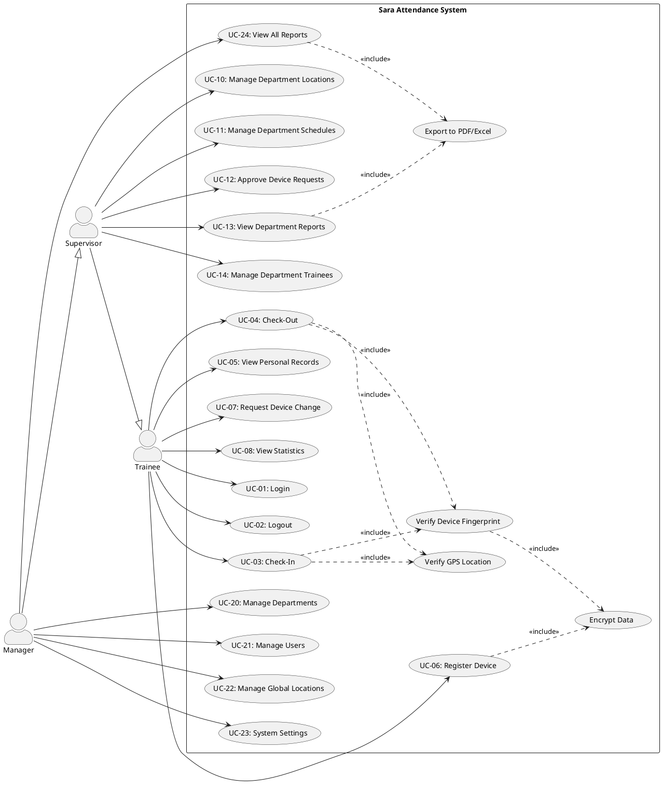
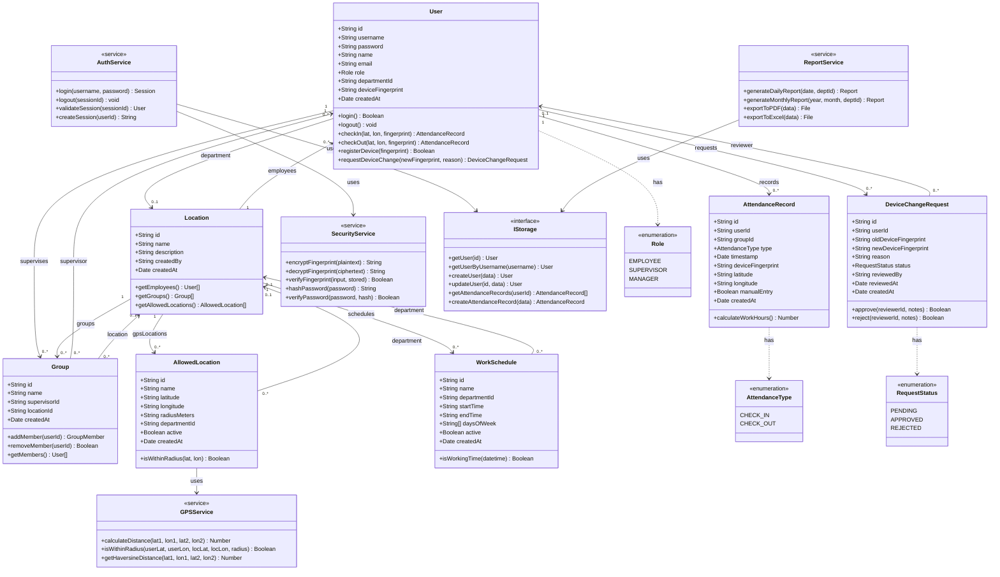
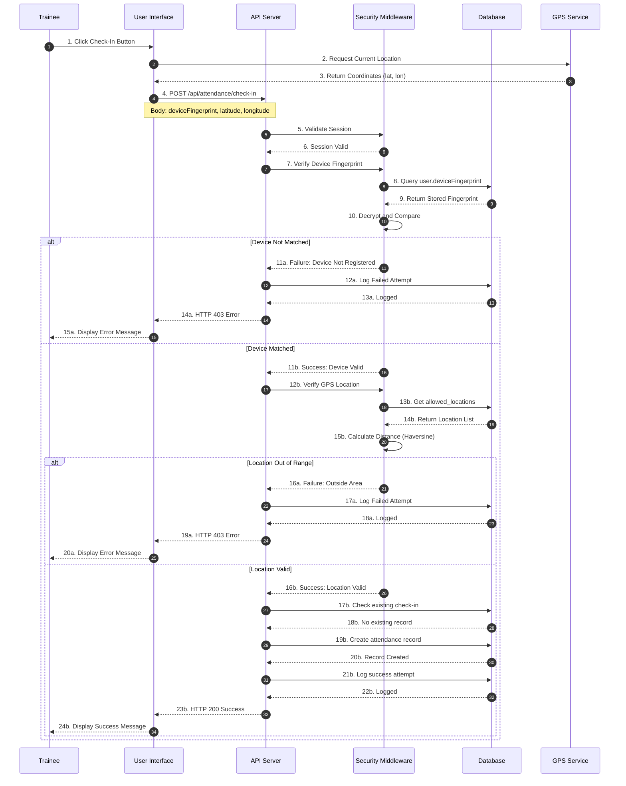
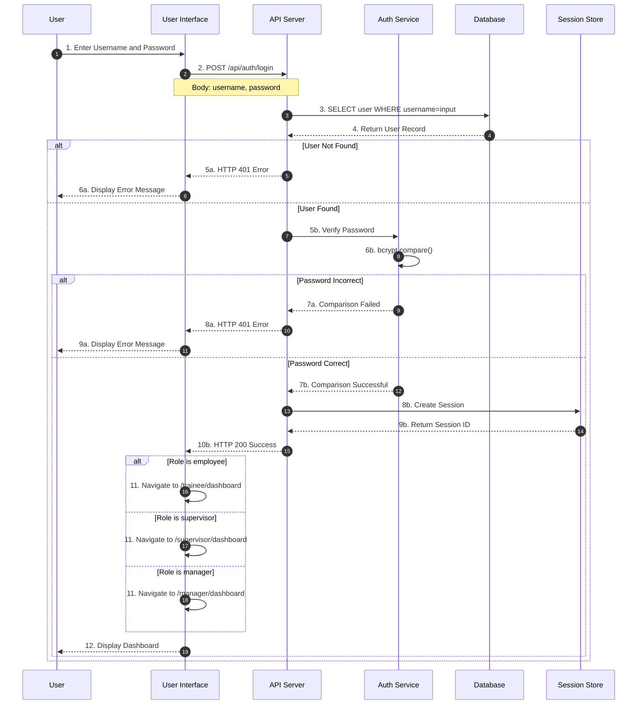
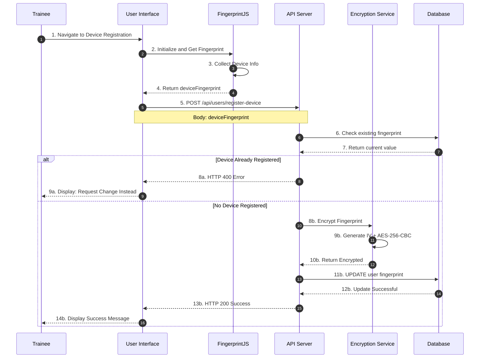
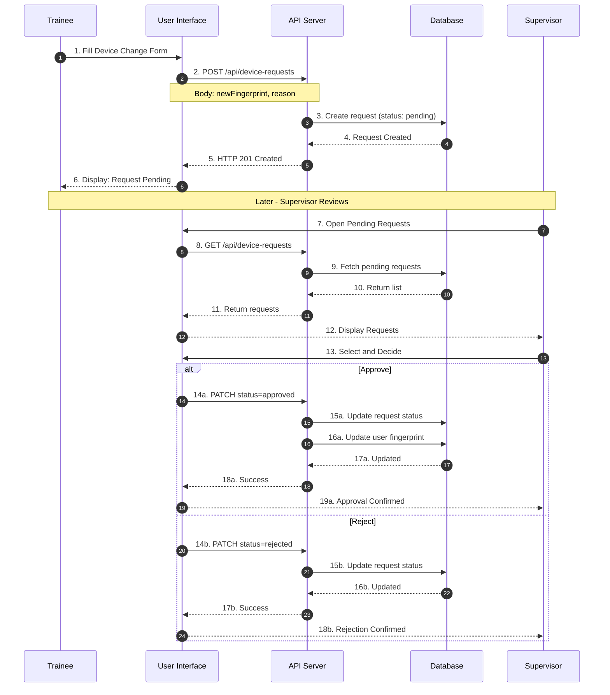

# Visual Diagrams - Sara Portal
# Attendance and HRM Management System

**Version:** 1.0  
**Date:** December 2024

---

## 1. Use Case Diagram

### Generated Image


### PlantUML Code



### How to Render
1. Copy the code above
2. Go to: https://www.plantuml.com/plantuml/
3. Paste the code and click "Submit"
4. Download the generated image

---

## 2. Class Diagram

### Generated Image


### Mermaid Code



### How to Render
1. Copy the code above (without the ```mermaid wrapper)
2. Go to: https://mermaid.live
3. Paste the code in the editor
4. Download as PNG or SVG

---

## 3. Sequence Diagram - Check-In Process

### Generated Image


### Mermaid Code (Fixed - No activate/deactivate)



### How to Render
1. Copy the code above (without the ```mermaid wrapper)
2. Go to: https://mermaid.live
3. Paste the code in the editor
4. Download as PNG or SVG

---

## 4. Sequence Diagram - Login Process

### Mermaid Code



---

## 5. Sequence Diagram - Device Registration

### Mermaid Code



---

## 6. Sequence Diagram - Device Change Request

### Mermaid Code



---

## Summary

| Diagram | Type | Code Format | Image File |
|---------|------|-------------|------------|
| Use Case | UML | PlantUML | `use_case_diagram_sara_system.png` |
| Class | UML | Mermaid | `class_diagram_system_structure.png` |
| Sequence (Check-In) | UML | Mermaid | `sequence_diagram_check-in_process.png` |
| Sequence (Login) | UML | Mermaid | - |
| Sequence (Device Reg) | UML | Mermaid | - |
| Sequence (Device Change) | UML | Mermaid | - |

### Online Rendering Tools

| Tool | URL | Supports |
|------|-----|----------|
| PlantUML Online | https://www.plantuml.com/plantuml/ | PlantUML code |
| Mermaid Live Editor | https://mermaid.live | Mermaid code |

---

**End of Document**

*Prepared by: Sara Portal Development Team*  
*Date: December 2024*
